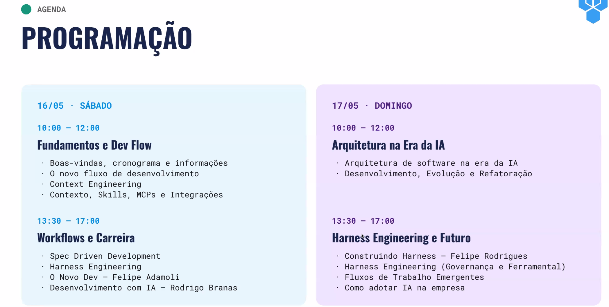
# Palavras
Plano, Teste, Capacete

# Context Eng
- Não compactar contexto (ver como faz isso no claude)
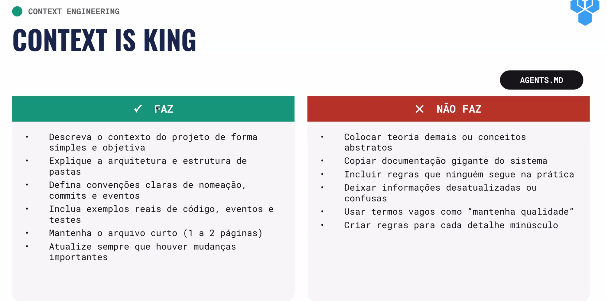
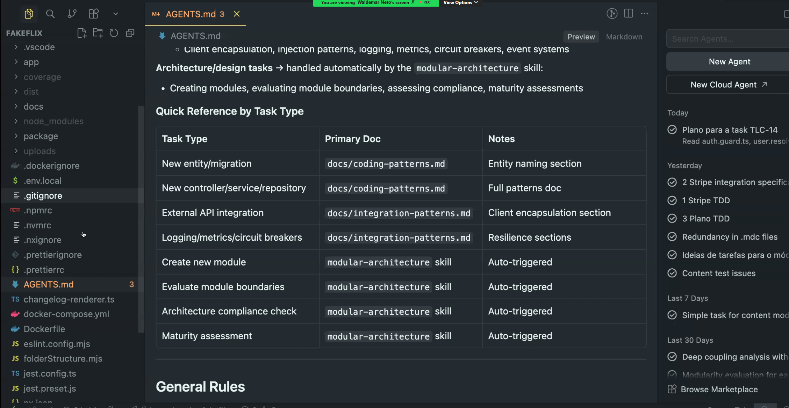
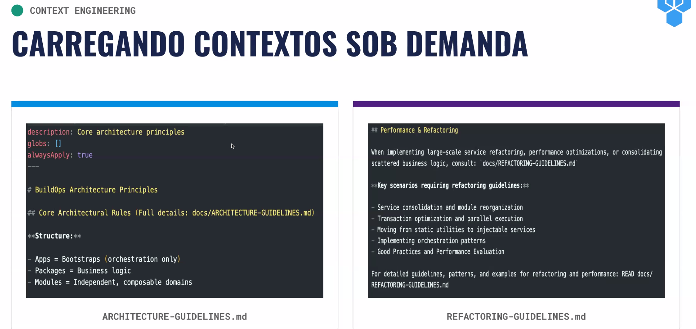
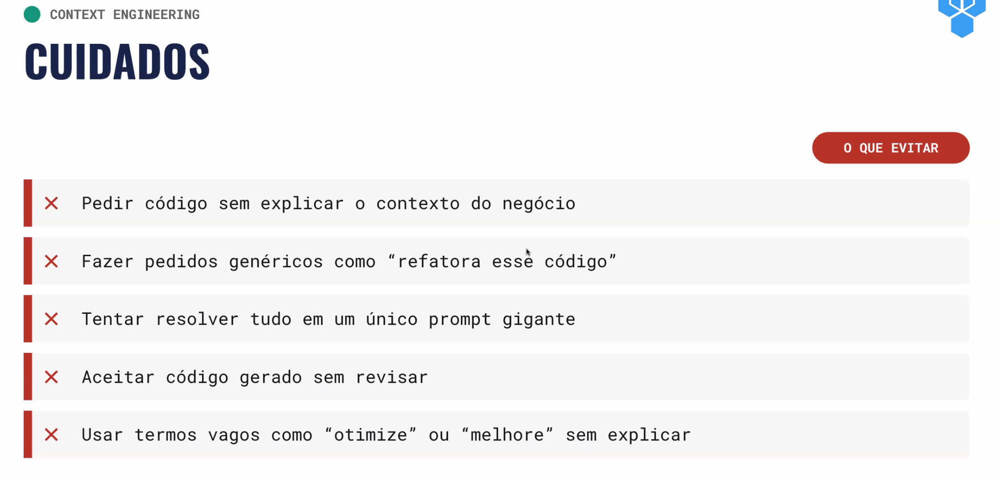

# Fluxo
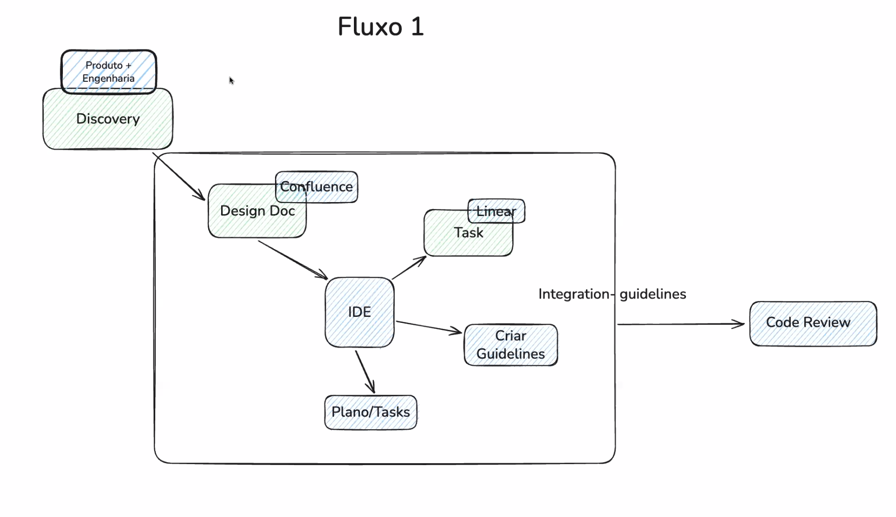
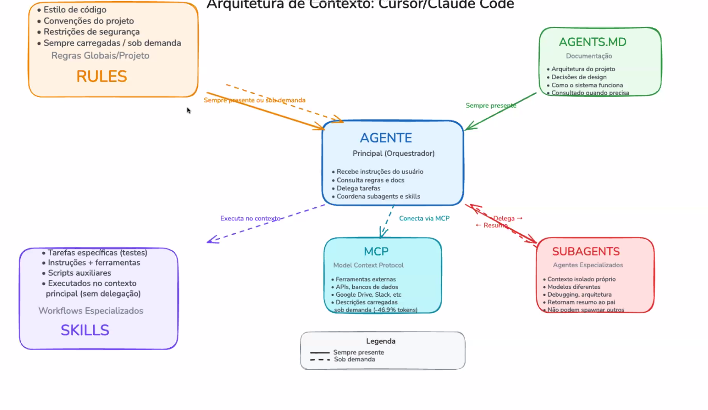
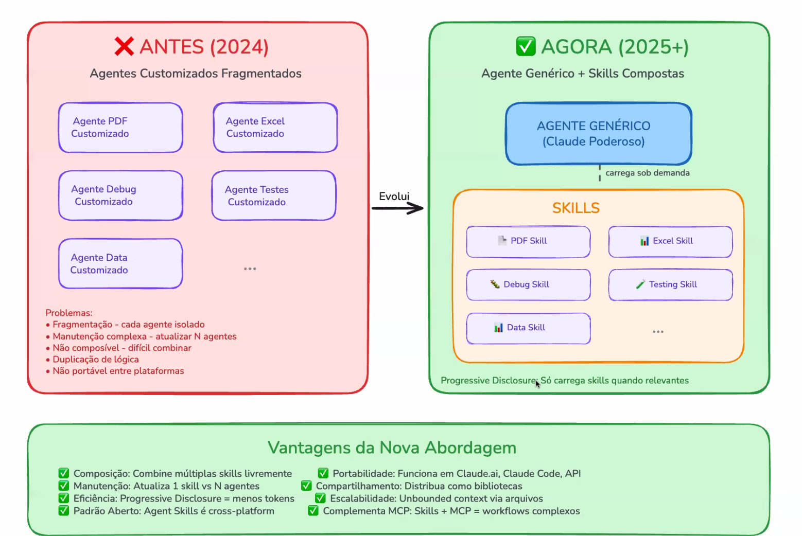
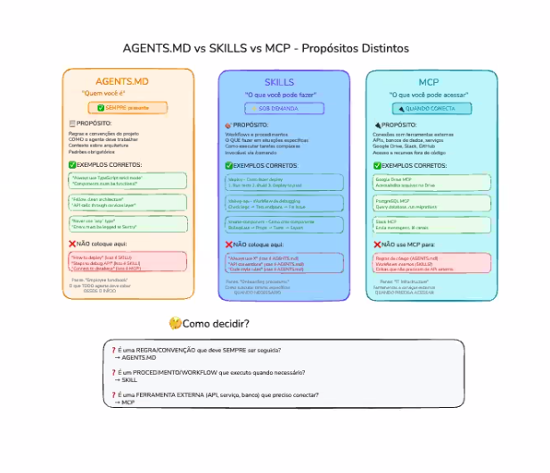

# Spec-Driven
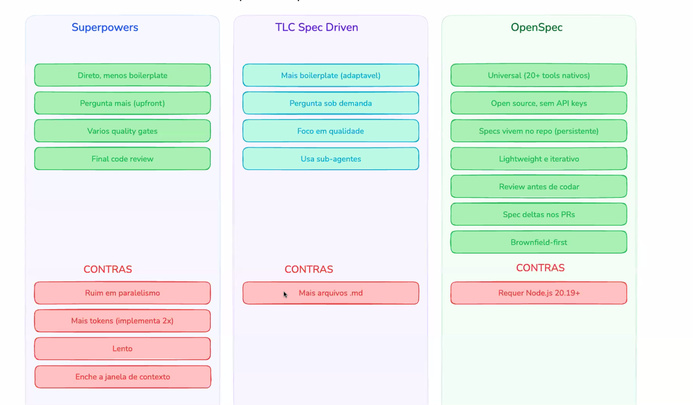

# Harness
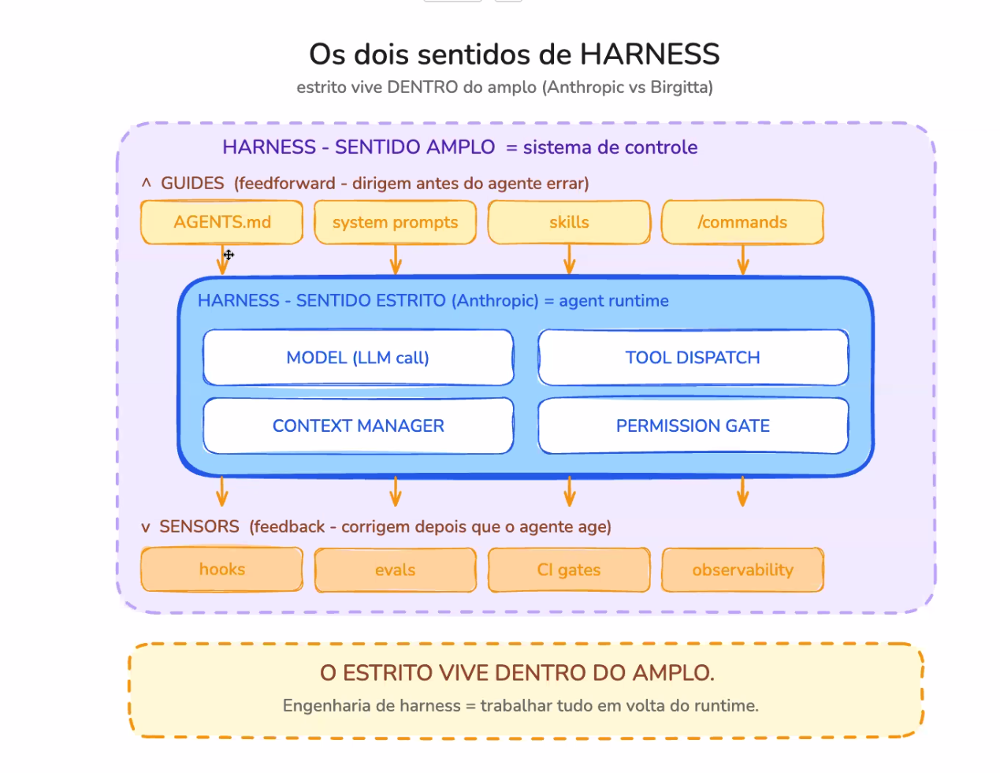
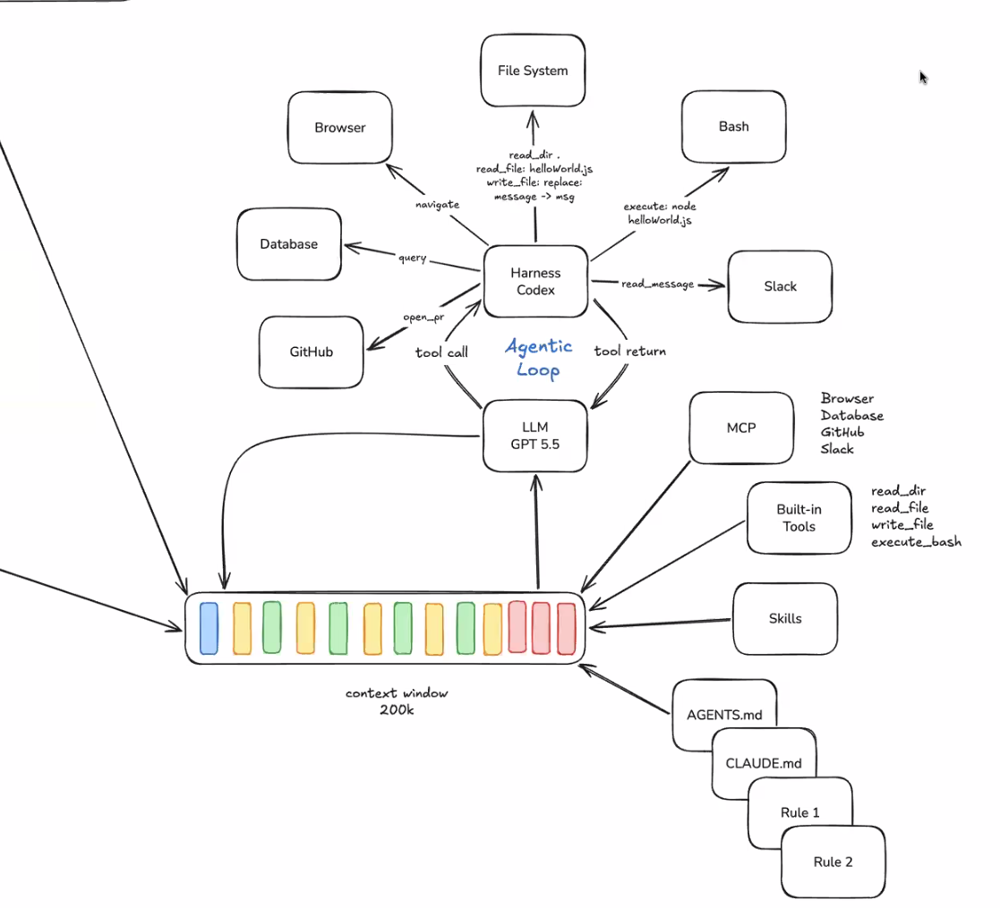
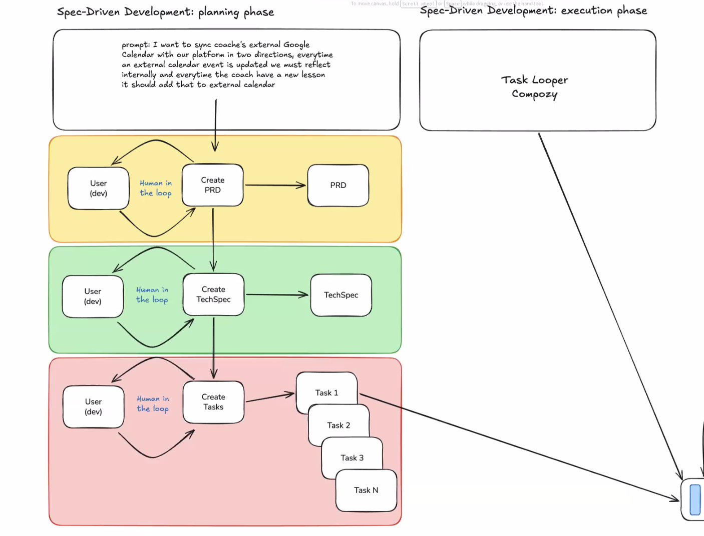

# Ferramentas
getdesign.md
https://github.com/compozy/compozy